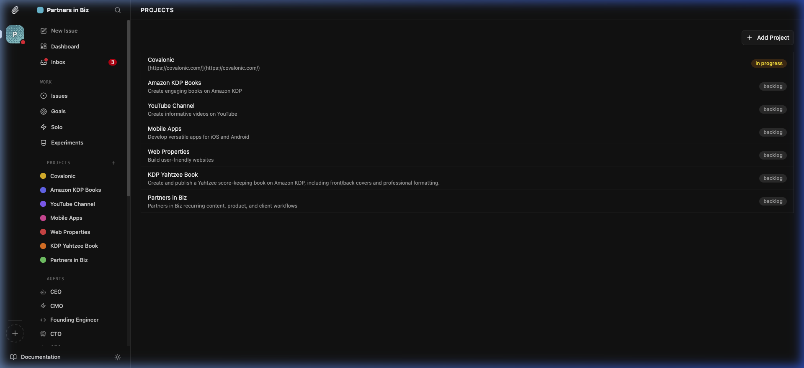
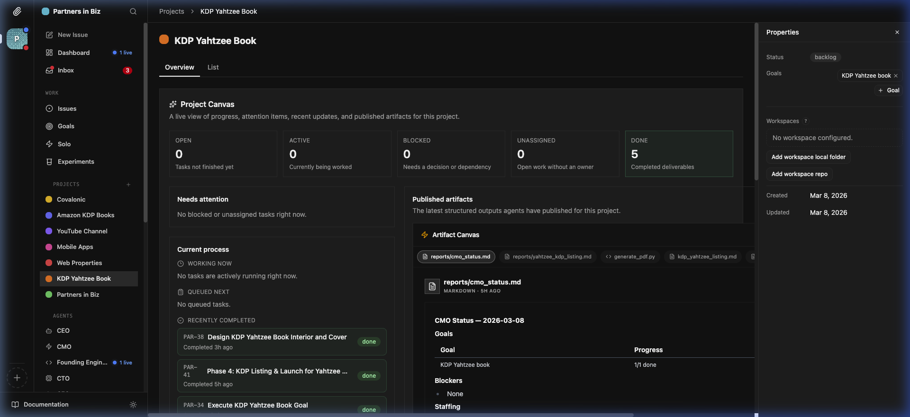
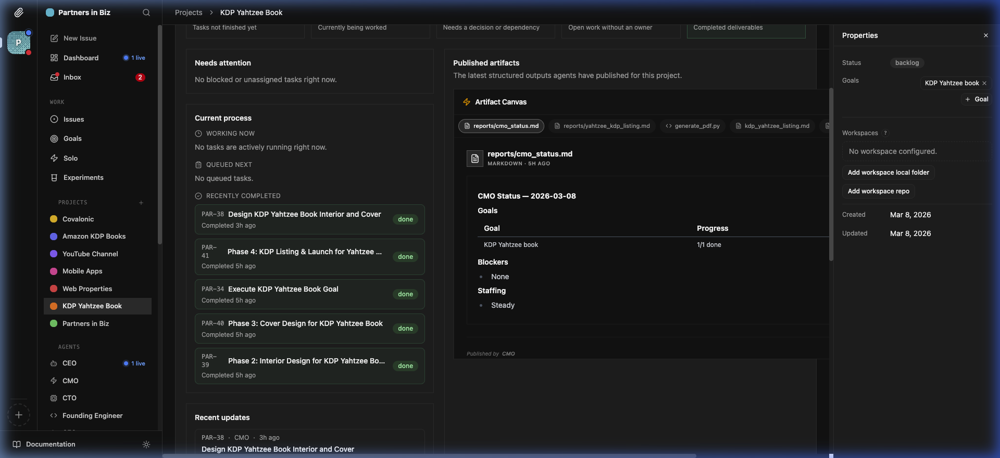
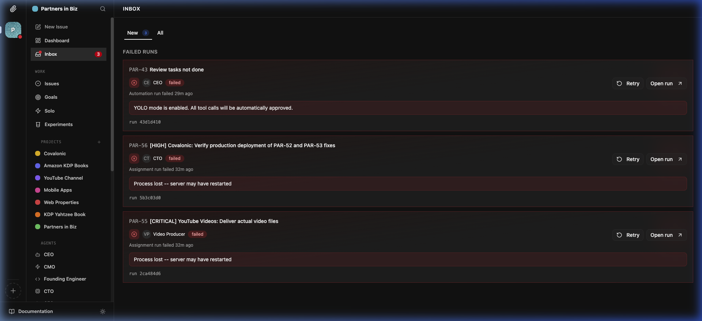
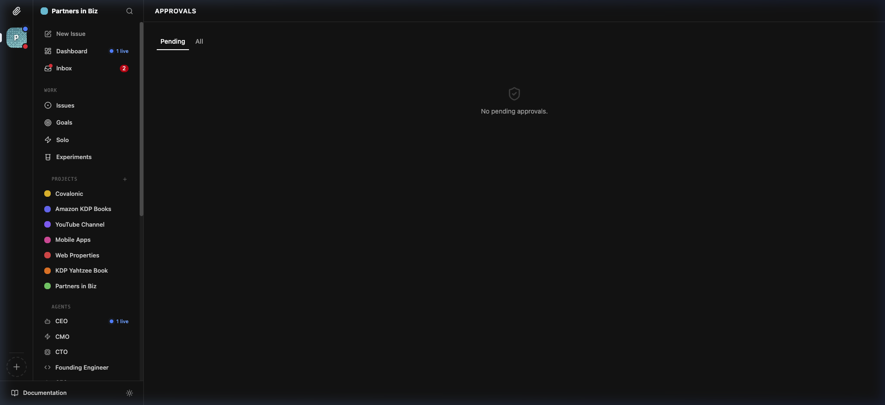
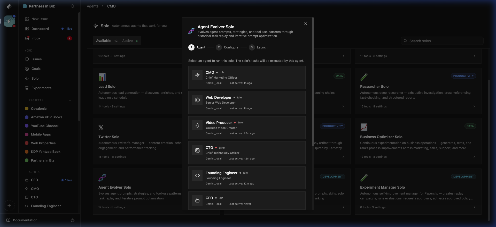
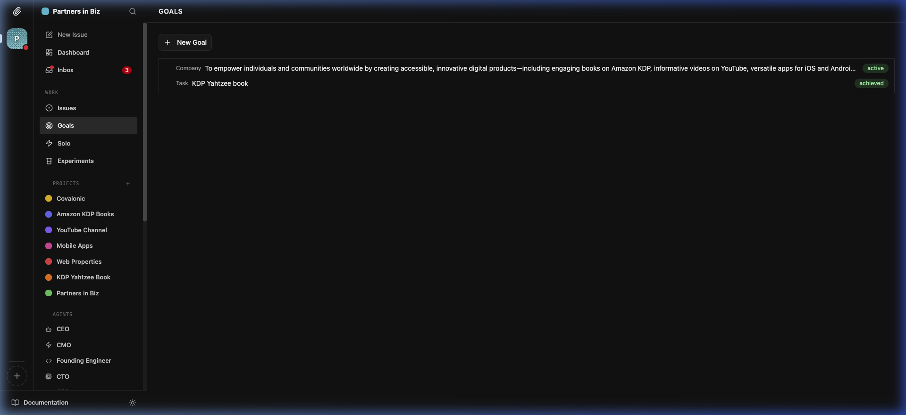

# Dogfood Report: Paperclip

| Field | Value |
|-------|-------|
| **Date** | 2026-03-08 |
| **App URL** | http://localhost:3100 |
| **Session** | paperclip-local |
| **Tester** | Antigravity |
| **Scope** | Full app — agent-run business platform (KDP books, YouTube videos, mobile apps, websites). Focus on: product/deliverable visibility, Projects UX, Inbox completeness, self-evolution, automation gaps. |

---

## Summary

| Severity | Count |
|----------|-------|
| Critical | 2 |
| High     | 3 |
| Medium   | 3 |
| Low      | 2 |
| **Total** | **10** |

---

## Issues

### ISSUE-001: Finished Product Deliverables Are Completely Invisible

| Field | Value |
|-------|-------|
| **Severity** | critical |
| **Category** | functional / ux |
| **URL** | http://localhost:3100/PAR/projects/kdp-yahtzee-book |
| **Repro Video** | N/A (static issue, confirmed by screenshots) |

**Description**

The Yahtzee KDP book is marked as "achieved" in Goals and all 5 tasks are marked "done" in the project. The CMO agent posted a comment claiming `yahtzee_interior.pdf` and `yahtzee_cover.pdf` were created. However, there is **no way for the user to access, download, or even see these files** in the UI. The "Published artifacts" / Artifact Canvas only shows `.md` reports and a Python script — not the actual binary output files (PDFs). The user literally cannot find or use their finished product.

**Repro Steps**

1. Navigate to http://localhost:3100/PAR/projects
   

2. Click "KDP Yahtzee Book"
   

3. **Observe:** "Done: 5 — Completed deliverables" shown in stats. Artifact Canvas shows `reports/cmo_status.md`, `reports/yahtzee_kdp_listing.md`, `generate_pdf.py`, `kdp_yahtzee_listing.md` — **no PDFs, no downloadable outputs**.
   

4. **Observe:** CMO agent status report says "Goal: KDP Yahtzee book — 1/1 done / Blockers: None" with no file links. The PDF filenames mentioned in comments are plain text, not clickable links.

**Root cause direction:** Agents save binary files to their local working directory but the Artifact Canvas only surfaces files that agents publish as structured `artifact:` blocks in their comments. Binary files (PDFs, video files, APKs) are never surfaced because agents don't publish them as artifacts.

**Fix needed:**
- Project workspace file browser showing all files generated in the project working directory
- "Deliverables" tab or section that highlights binary outputs separately
- Agent instructions should require uploading/linking final output files as accessible artifacts

---

### ISSUE-002: Projects List Shows All Projects as "backlog" Despite Completion

| Field | Value |
|-------|-------|
| **Severity** | critical |
| **Category** | functional / ux |
| **URL** | http://localhost:3100/PAR/projects |
| **Repro Video** | N/A |

**Description**

The Projects list page shows Amazon KDP Books, YouTube Channel, Mobile Apps, Web Properties, KDP Yahtzee Book, and Partners in Biz — all with "backlog" status badges. The KDP Yahtzee Book project has all 5 tasks marked done and its goal marked "achieved", yet still shows "backlog". Only Covalonic shows "in progress". The project-level status never automatically updates based on task/goal completion, creating a completely misleading view.

**Repro Steps**

1. Navigate to http://localhost:3100/PAR/projects
2. **Observe:** All 6 projects except Covalonic show "backlog" status
   
3. Click "KDP Yahtzee Book" — see 5 done tasks, goal achieved, yet project is still "backlog"
   

**Fix needed:**
- Auto-update project status based on linked goal/issue completion
- Projects page should show a richer summary: task completion %, last activity, deliverables count, etc.
- Consider a card/grid view instead of a plain list

---

### ISSUE-003: Inbox Only Shows Failed Runs — Approvals and User-Input Requests Are Absent

| Field | Value |
|-------|-------|
| **Severity** | high |
| **Category** | ux / functional |
| **URL** | http://localhost:3100/PAR/inbox |
| **Repro Video** | videos/issue-003-inbox-repro.webm |

**Description**

The user's mental model is: "The Inbox is where I go to see everything that needs my attention." The current Inbox only shows **agent run failures** (3 items: PAR-43 CEO failed, PAR-56 CTO failed, PAR-55 Video Producer failed — all with "Process lost" errors). There is no section for: pending approvals, issues awaiting user review, issues where an agent is blocked on user input, or scheduled tasks needing confirmation. Approvals live at an entirely separate URL (`/PAR/approvals`) with no sidebar link. A user who needs to act on agent work has to know to navigate there manually.

**Repro Steps**

1. Click "Inbox" in sidebar (badge shows 3)
   
2. **Observe:** 3 items shown: PAR-43 (CEO Review tasks not done — YOLO mode enabled), PAR-56 (CTO Verify production deployment — Process lost), PAR-55 (Video Producer YouTube Videos — Process lost). All are run failures requiring Retry.
3. Look for pending approvals in the Inbox — **there are none listed here**
4. Navigate to http://localhost:3100/PAR/approvals — approvals are a completely separate page with no sidebar link
   

**Fix needed:**
- Unify Inbox sections: "Needs your input" (approvals + blocked-on-user tasks) + "Failed runs" (current) + "Review requests"
- Add "Approvals" link to the main sidebar under WORK section
- Show badge/count for pending approvals alongside the Inbox badge

---

### ISSUE-004: Approvals Section Has No Sidebar Link (Hidden Navigation)

| Field | Value |
|-------|-------|
| **Severity** | high |
| **Category** | ux / functional |
| **URL** | http://localhost:3100/PAR/approvals |
| **Repro Video** | N/A |

**Description**

The Approvals page exists and functions (`/PAR/approvals`) but is completely absent from the sidebar navigation. A user has no way to discover it without knowing the URL. Since the whole premise of the system is human-in-the-loop oversight of agents, the inability to easily reach the approvals queue is a significant governance gap.

**Repro Steps**

1. Look at the sidebar — scan every section (Dashboard, Inbox, Issues, Goals, Solo, Experiments, Projects, Agents)
2. **Observe:** No "Approvals" link exists anywhere in the sidebar
   
3. Type http://localhost:3100/PAR/approvals manually — page works fine but shows "No pending approvals"

**Fix needed:**
- Add "Approvals" as a sidebar item under WORK, with a badge for pending count
- Or: Merge into the Inbox as a tab

---

### ISSUE-005: CTO and Video Producer Agents Show "Error" Status but No Alert in UI

| Field | Value |
|-------|-------|
| **Severity** | high |
| **Category** | functional |
| **URL** | Solo agent selection dialog |
| **Repro Video** | N/A |

**Description**

In the Agent Evolver Solo configuration dialog, selecting which agent to run shows: CMO (Idle), Web Developer (Idle), **Video Producer (Error)**, **CTO (Error)**, Founding Engineer (Idle), CFO (Idle). Two core agents are in an error state. However, there is no alert, notification, or inbox item specifically about "agents are in a degraded/error state." The user would only discover this by opening the Solo setup dialog. The Inbox shows run failures from CTO and Video Producer (PAR-56, PAR-55) but doesn't surface "Agent is in error state" as a system-level alert.

**Repro Steps**

1. Navigate to Solo section → click "Agent Evolver Solo"
2. **Observe:** Step 1 "Agent" selection shows Video Producer and CTO with red "Error" dot
   
3. Check Inbox — shows PAR-56 (CTO failed) and PAR-55 (Video Producer failed) with "Process lost" errors
4. **Observe:** No system-level banner or persistent alert about agents being non-functional

**Fix needed:**
- Dashboard should show "2 agents in error" prominently, not just as part of the run activity chart
- Failed agents should auto-retry with exponential backoff (self-healing)
- Self-correction: when an agent's process is lost due to server restart, it should automatically re-queue its current task

---

### ISSUE-006: Goals Page Is Extremely Sparse — No Task/Project Drill-Down

| Field | Value |
|-------|-------|
| **Severity** | medium |
| **Category** | ux |
| **URL** | http://localhost:3100/PAR/goals |
| **Repro Video** | N/A |

**Description**

The Goals page shows: 1 company-level goal (the mission statement), and 1 task-level goal "KDP Yahtzee book" (marked "achieved"). That's it — a 2-row list. There is no way to see: progress bars, linked projects, linked issues, what's been produced towards each goal, or what the next goal should be. The company goal (the big mission statement about empowering individuals) is just descriptive text with "active" status — it never breaks down into sub-goals or shows how the projects contribute.

**Repro Steps**

1. Navigate to Goals — immediately see two rows
   
2. **Observe:** Company goal shows the full mission text, no breakdown. "KDP Yahtzee book" shows "achieved" with no link to the deliverable.
3. Click on the Yahtzee goal — no drill-down to the PDF artifact or any evidence of achievement

**Fix needed:**
- Goals should show: linked project(s), task completion bars, last deliverable produced, link to artifact
- Sub-goals or milestones tree (Company goal → Product goals → Project goals)
- "Achieved" goals should link to the finished product/deliverable

---

### ISSUE-007: Persistent WebSocket Errors in Browser Console

| Field | Value |
|-------|-------|
| **Severity** | medium |
| **Category** | console |
| **URL** | All pages |
| **Repro Video** | N/A |

**Description**

Every page generates WebSocket connection errors: `WebSocket connection to 'ws://localhost:3100/api/...' failed: WebSocket is closed before the connection is established.` This means live updates (agent run progress, inbox badge counts) may not update in real-time, requiring manual page refreshes to see the latest state. This undermines the "live" feel of the platform.

**Repro Steps**

1. Open browser developer tools → Console tab
2. Navigate to any page (Dashboard, Inbox, etc.)
3. **Observe:** Repeated `WebSocket connection failed` errors
4. Consequence: The "1 live" indicator on Dashboard/CEO may not actually refresh live

**Fix needed:**
- Implement WebSocket reconnection with exponential backoff
- Show a "Reconnecting..." indicator when WS is disconnected rather than silently failing

---

### ISSUE-008: Project Canvas Conflates Work Artifacts with Final Deliverables

| Field | Value |
|-------|-------|
| **Severity** | medium |
| **Category** | ux |
| **URL** | http://localhost:3100/PAR/projects/kdp-yahtzee-book (Overview) |
| **Repro Video** | N/A |

**Description**

The "Published artifacts" Artifact Canvas in a project overview mixes internal working files (CMO status reports, planning docs, Python scripts) with anything that could be considered a final deliverable. This makes the canvas feel like a developer's debug log rather than a product owner's deliverables shelf. A business operator should see final products prominently, with internal reports collapsed or hidden by default.

**Repro Steps**

1. Navigate to KDP Yahtzee Book project overview
2. **Observe:** Artifact Canvas tabs include `reports/cmo_status.md`, `reports/yahtzee_kdp_listing.md`, `generate_pdf.py`, `kdp_yahtzee_listing.md`
   
3. Click each tab — they show internal reports, not the actual book files

**Fix needed:**
- Separate "Deliverables" (PDFs, videos, APKs, URLs) from "Work artifacts" (reports, scripts)
- Allow agents to tag artifacts as `type: deliverable` vs `type: internal`
- Show deliverables at the top with download buttons

---

### ISSUE-009: "No workspace configured" Blocks File Access for Most Projects

| Field | Value |
|-------|-------|
| **Severity** | medium |
| **Category** | functional |
| **URL** | All project pages → Properties panel |
| **Repro Video** | N/A |

**Description**

Every project except implicitly Covalonic shows "No workspace configured." in the Properties panel. This likely means the system cannot show local files generated by agents, cannot open a file browser, and cannot link agents to a specific working directory. Given that agents are supposed to be producing actual files (PDFs, videos, code), the lack of workspace configuration means outputs are inaccessible.

**Repro Steps**

1. Navigate to any project → look at the right-hand Properties panel
2. **Observe:** "No workspace configured. / Add workspace local folder / Add workspace repo"
   
3. The agents are clearly running (5 done tasks) but there is no connected workspace to find their output

**Fix needed:**
- When creating a project + assigning agents, prompt for a workspace directory
- Auto-create workspace directories for agent-produced projects
- Show workspace file browser inline in project overview

---

### ISSUE-010: Projects Section UX — No Card View, Progress Indicators, or Business Metrics

| Field | Value |
|-------|-------|
| **Severity** | low |
| **Category** | ux |
| **URL** | http://localhost:3100/PAR/projects |
| **Repro Video** | N/A |

**Description**

The Projects list is a plain text list with just name, description, and a status badge. For an agent-run business operator, there is no way to see at a glance: how many tasks are done vs. total, how many deliverables have been produced, any revenue or performance metrics, or when a project was last active. It looks the same whether a project is 0% or 100% complete.

**Repro Steps**

1. Navigate to http://localhost:3100/PAR/projects
2. **Observe:** Plain row list — all rows look identical
   
3. No way to compare projects at a glance or see their production status

**Fix needed:**
- Card/grid view with: project color, task completion progress bar, # deliverables, last activity timestamp
- Filter/sort: by status, activity recency, deliverable count
- "Recently active" sorting by default

---

## End-to-End Automation Gaps (Beyond Individual Issues)

These are systemic observations relevant to the user's goal of maximum automation:

| Gap | Description | Priority |
|-----|-------------|----------|
| **Agent self-correction on process loss** | When "Process lost — server may have restarted", the agent run is simply marked failed and the user must manually click "Retry". This should be automatic. | Critical |
| **Binary file surfacing pipeline** | Agents produce PDFs, videos, etc. but these never appear in the UI. Needs an artifact upload/registry system. | Critical |
| **Cross-project deliverables dashboard** | No single place to see "All finished products" across Amazon KDP Books, YouTube, Mobile Apps, etc. | High |
| **Approval routing to Inbox** | Human approval requests go to a hidden `/approvals` page, not the Inbox. If an agent needs user input, the user may never see it. | High |
| **Project status auto-progression** | Projects should auto-advance from backlog → in_progress → done as agents work. | Medium |
| **WebSocket reconnection** | Live updates fail silently; users must refresh to see agent progress. | Medium |

---

## Recordings

| Recording | Content |
|-----------|---------|
| [Initial Exploration](../../../.gemini/antigravity/brain/77136f52-ca2f-4434-9cb5-acf97978003b/paperclip_initial_exploration_1772987606790.webp) | Full sidebar nav, all sections visited |
| [Dashboard & Inbox Deep Dive](../../../.gemini/antigravity/brain/77136f52-ca2f-4434-9cb5-acf97978003b/paperclip_dashboard_inbox_deep_1772988231224.webp) | Dashboard, Inbox, Issues, Goals detail |
| [Projects Deep Dive](../../../.gemini/antigravity/brain/77136f52-ca2f-4434-9cb5-acf97978003b/paperclip_projects_deep_1772988653000.webp) | Projects list, Yahtzee book, artifact canvas |
| [Agents, Solo, Experiments](../../../.gemini/antigravity/brain/77136f52-ca2f-4434-9cb5-acf97978003b/paperclip_agents_approvals_solo_1772989338091.webp) | CEO/CMO agents, Agent Evolver, Experiments, Approvals |
